# Artistic Style Transfer Investigation

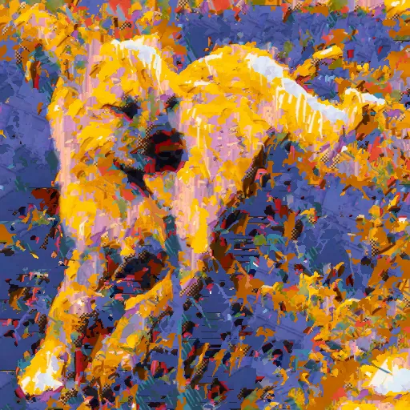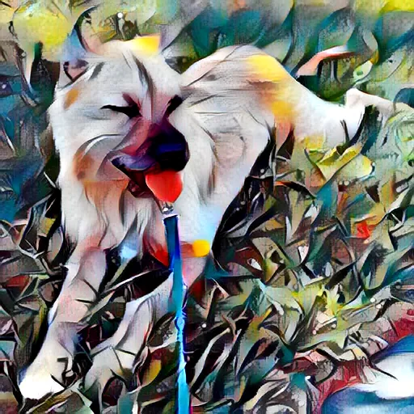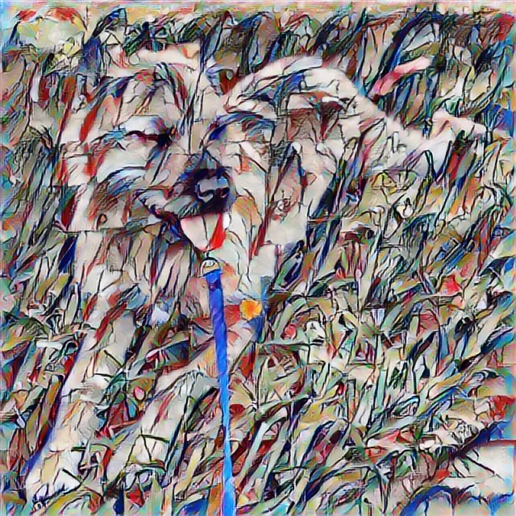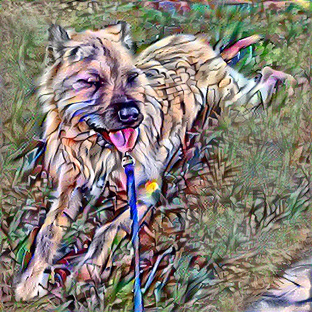

Remixing the content of one image into the style of another is the type of task that invites a variety of creative mathematical approaches. This project serves as a comparison of some of these methodologies, and a tool for testing them out.

1. **Patch-based** (Image Analogies, Hertzmann et al., 2001) - the pre-neural baseline. No learning and no features beyond raw pixel statistics: for each output pixel, search the style image for a 5×5 luminance patch whose neighbourhood best matches the content image around that point, then copy the corresponding style pixel into the output. Slow and visibly softer than the neural methods - included as the historical bookend.
2. **Optimization-based** (Gatys, Ecker & Bethge, 2015) - the founding approach, and the one that established neural style transfer as a problem at all. Each output image is iteratively optimized from scratch against content and style targets. Slow, but produces strikingly painterly results.
3. **Feed-forward CNN** (Magenta, 2017) - Google's answer to the speed problem. A learned network emits a stylized image in a single forward pass; results return in seconds, at the cost of a smoother, more averaged stylization than Gatys produces.
4. **Transformer** (StyTr², 2022) - feed-forward like Magenta, but trades convolutional encoders for attention over image patches, addressing Magenta's tendency to lose fine style detail and content tonality.

The pointed omission is **diffusion** based style transfer, explored in the [sibling project](https://github.com/AnthonyBurre/diffusion-style-transfer).

## Quick start

With [uv](https://docs.astral.sh/uv/) installed, sync the extra that matches your hardware:

| Hardware                              | Sync command                              |
| ------------------------------------- | ----------------------------------------- |
| Any CPU*                              | `uv sync --extra cpu`                     |
| Apple Silicon (Metal GPU)             | `uv sync --extra cpu --extra metal`       |
| NVIDIA GPU (Linux native, or WSL2)    | `uv sync --extra cuda`                    |
<sub>*AMD/Intel GPUs have no working path.</sub>

Run the GUI at http://localhost:7860 for interactive exploration:

```shell
uv run python -m src.app
```

Use the CLI for scripting/batch processing:

```shell
uv run python -m src.cli \
  -c examples/content/lighthouse.png \
  -s examples/style/ty.png \
  -o out.png -m gatys
```
Accepts directories on `-c` / `-s` for batch runs, see `-h` for all flags:

```shell
uv run python -m src.cli -h
```

## Docker option

CPU-only, but no need to install uv or python:

```shell
docker build -t style-transfer .
docker run --rm -m 4g -p 7860:7860 style-transfer
```

CLI variant, with a host-mounted working dir so the output file lands back on the host:

```shell
docker run --rm -m 4g \
  -v "$PWD:/work" -w /work \
  -v "$PWD/model-stytr2:/app/model-stytr2" \
  style-transfer \
  src.cli -c examples/content/hoodwinked.png \
          -s examples/style/spiderverse.png \
          -o out.png -m stytr2
```

Mount `$PWD/model:/app/model` instead when running Magenta, otherwise its weights re-download every invocation.

## Example Images

For those of you who are too busy to clone and run this yourself, I've included some examples here. A good model will work its magic on any sort of content image respectably, but it is more up to the user to select an optimal style image for best results.

### `examples/content/`

<table>
<tr>
<td align="center" width="33%"></td>
<td align="center" width="33%"></td>
<td align="center" width="33%"></td>
</tr>
<tr>
<td align="center"><sub>640x640. My absolutely perfect dog Katy taking a rest during a sunny walk on some nice grass.</sub></td>
<td align="center"><sub>912×513. A frame of an old film whose graphics could use an update. Is style transfer the answer?</sub></td>
<td align="center"><sub>535×640. White architectural form against a wispy-cloud sky - hard high-contrast edges beside broad smooth gradient regions.</sub></td>
</tr>
</table>

### `examples/style/`

<table>
<tr>
<td align="center" width="33%"></td>
<td align="center" width="33%">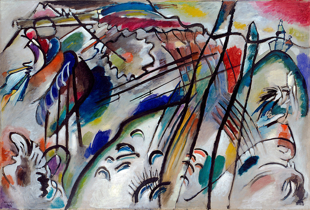</td>
<td align="center" width="33%"></td>
</tr>
<tr>
<td align="center"><sub>My little brother's painting - Visible brushwork and a landscape palette - loose, painterly marks rather than hard graphic edges.</sub></td>
<td align="center"><sub>Kandinsky's <i>Improvisation 28</i> - early abstract expressionism. Likely in the training datasets the original NST papers used.</sub></td>
<td align="center"><sub>Frame from Spiderverse movie - Halftone dots, chromatic aberration, comic-book outlines and a vibrant complementary palette.</sub></td>
</tr>
</table>

## Models

This project compares four methodologies of image style transfer, spanning the non-neural patch baseline of 2001 through contemporary transformer-based attention mechanisms. All the models here take exactly one content and one style image as input, but it would be interesting to look into models like CycleGAN (which would take a collection of style images) in the future. Arbitrary-style GAN variants (AdaIN/WCT-style generators, MUNIT) do accept a single style image at inference, but are mechanically a flavour of feed-forward CNN and don't open a new era beyond what Magenta already represents here, see [Further reading](#further-reading).


### Image Analogies - patch-based pre-neural baseline

Hertzmann, Jacobs, Oliver, Curless & Salesin (SIGGRAPH 2001), the pre-neural bookend. With no learning and no features beyond raw pixel statistics, each output pixel is filled by finding the 5×5 luminance patch in the style image whose neighbourhood best matches the content, then copying the corresponding style pixel across; a 4-level Gaussian pyramid and an Ashikhmin coherence term carry structure across scales.

Matching runs on YIQ luminance only, so structure rather than colour drives the search while the style's IQ chroma transfers unchanged for its palette. Both inputs cap at 512 px longest-side.

The result is visibly softer and noisier than the neural methods. Runtime is ~1 min for rectangular inputs and up to ~6 min for full 512² square content on CPU, with no GPU path.

<table>
<tr>
<td></td>
<td align="center" width="25%"></td>
<td align="center" width="25%"></td>
<td align="center" width="25%"></td>
</tr>
<tr>
<td align="center" width="25%"></td>
<td align="center">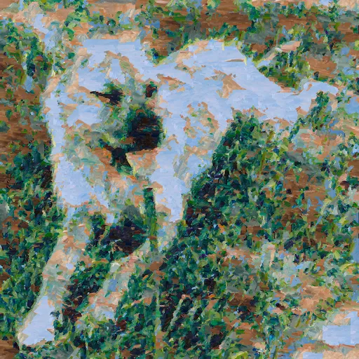</td>
<td align="center">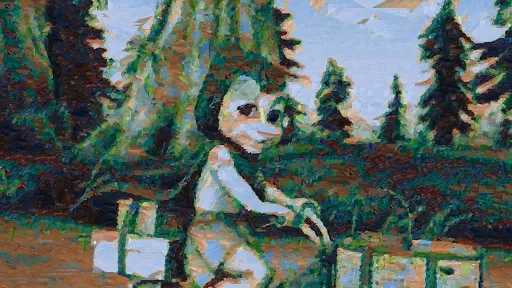</td>
<td align="center">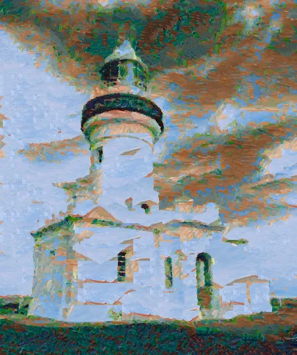</td>
</tr>
<tr>
<td align="center"></td>
<td align="center">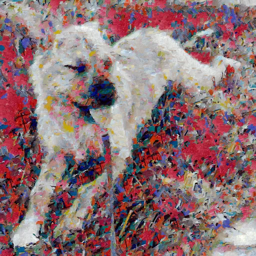</td>
<td align="center">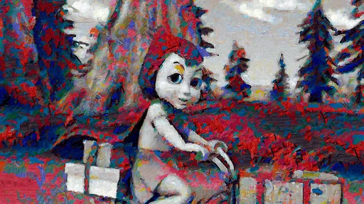</td>
<td align="center">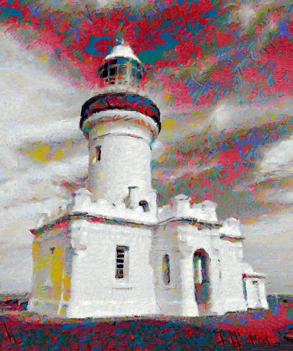</td>
</tr>
<tr>
<td align="center"></td>
<td align="center"></td>
<td align="center">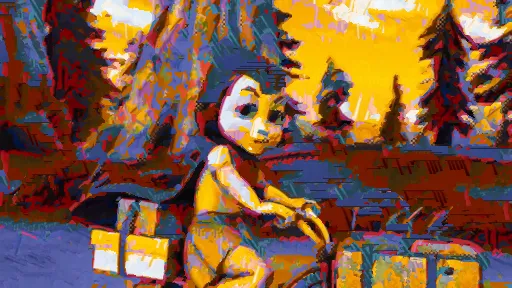</td>
<td align="center">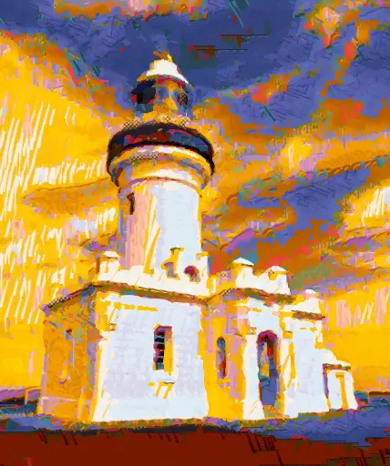</td>
</tr>
</table>

### Gatys VGG19 - optimization-based neural style transfer

The original Gatys, Ecker & Bethge (2015) formulation, and the slow one: there is no learned style mapping — each output image is optimized from scratch by Adam, the output pixels themselves the only parameters, against a content loss and a Gram-matrix style loss over VGG19 activations (~300 steps per request).

Both inputs are downsampled to 512 px longest-side; raise `MAX_DIM` in `src/methods/gatys.py` to 768 or 1024 for higher-resolution output.

Because Gram matrices encode texture statistics rather than spatial layout, output is markedly more abstracted and painterly than the feed-forward methods: content geometry survives, but objects bleed into the style's brushwork and palette in a way the others never quite manage. The price is speed, and optimizing pixels per request is exactly what the feed-forward methods below (Magenta, StyTr²) were built to avoid.

<table>
<tr>
<td></td>
<td align="center" width="25%"></td>
<td align="center" width="25%"></td>
<td align="center" width="25%"></td>
</tr>
<tr>
<td align="center" width="25%"></td>
<td align="center"></td>
<td align="center"></td>
<td align="center"></td>
</tr>
<tr>
<td align="center"></td>
<td align="center"></td>
<td align="center">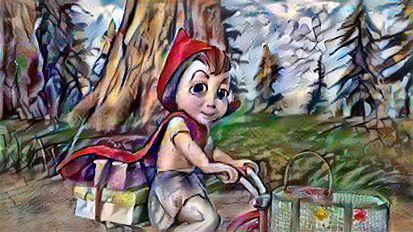</td>
<td align="center">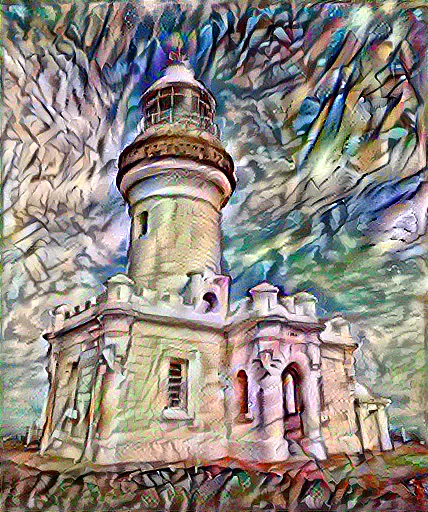</td>
</tr>
<tr>
<td align="center"></td>
<td align="center"></td>
<td align="center"></td>
<td align="center"></td>
</tr>
</table>

### Magenta - feed-forward arbitrary stylization

Ghiasi et al., Google Magenta (2017). A style-prediction sub-network compresses the style image into a low-dimensional embedding that parameterizes conditional instance-norm layers in a transfer network running over the content image, so the stylized image comes out in a single forward pass — no per-image optimization, no attention.

The transfer network runs fully-convolutionally, so output resolution tracks the content image's aspect ratio up to a 2048 px longest-side cap.

That single global style vector is also the limitation: it cannot localize fine ornament or hard edges in the style to specific regions of the content, so stylization tends toward a smoother, more "averaged" look than Gatys — colour palettes transfer well, but high-frequency style detail dissolves into the content's textures rather than persisting as discrete marks. It still returns in seconds and produces my favourite results of the four.

<table>
<tr>
<td></td>
<td align="center" width="25%"></td>
<td align="center" width="25%"></td>
<td align="center" width="25%"></td>
</tr>
<tr>
<td align="center" width="25%"></td>
<td align="center"></td>
<td align="center"></td>
<td align="center"></td>
</tr>
<tr>
<td align="center"></td>
<td align="center"></td>
<td align="center">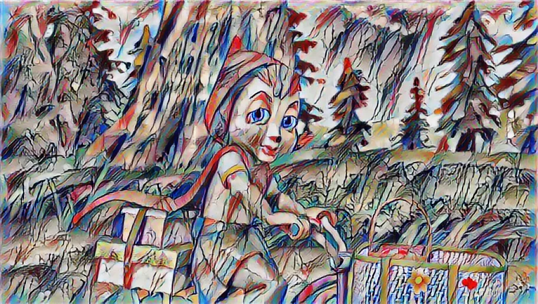</td>
<td align="center">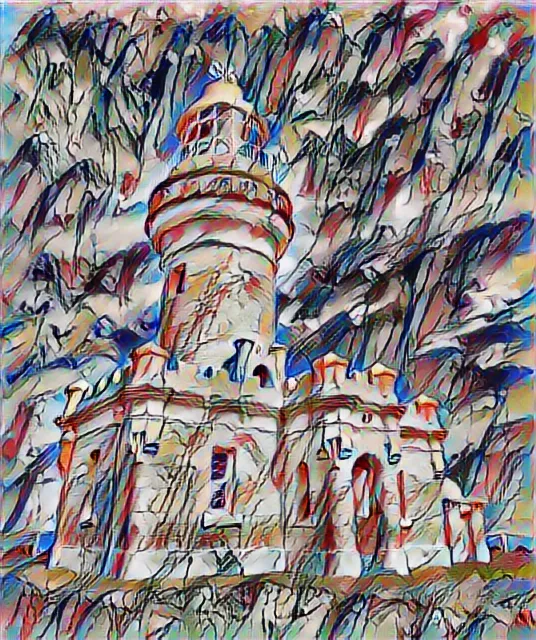</td>
</tr>
<tr>
<td align="center"></td>
<td align="center"></td>
<td align="center"></td>
<td align="center"></td>
</tr>
</table>

### StyTr² - transformer-based arbitrary style transfer

Deng et al. (CVPR 2022). A pure-transformer alternative to both CNN feed-forward (Magenta) and per-image optimization (Gatys): content and style are tokenized by a patch embedding, encoded by separate transformer stacks with content-aware positional encoding (CAPE), and fused by a cross-attention decoder before a convolutional upsampler returns to image space.

The patch-grid reshape assumes `H == W`, so wide content is centre-cropped to 512×512 before inference and loses its outer regions; pretrained weights are pulled from the `datnguyentien204/Sty_TR2_38` Hugging Face mirror on first use, and the path logs the device it loaded onto (CPU only on Apple Silicon).

Because attention operates patch-wise rather than through a single global style code, fine style detail and content tonality — notably true blacks — survive better than in Magenta, while inference stays feed-forward. Runtime sits between the other two at ~30 s on CPU at 512², bounded by the O(N²) attention over 64×64 = 4096 tokens. It is the most recent method here; the next era beyond it, diffusion, lives in the [sibling project](https://github.com/AnthonyBurre/diffusion-style-transfer).

<table>
<tr>
<td></td>
<td align="center" width="25%"></td>
<td align="center" width="25%"></td>
<td align="center" width="25%"></td>
</tr>
<tr>
<td align="center" width="25%"></td>
<td align="center"></td>
<td align="center"></td>
<td align="center"></td>
</tr>
<tr>
<td align="center"></td>
<td align="center"></td>
<td align="center">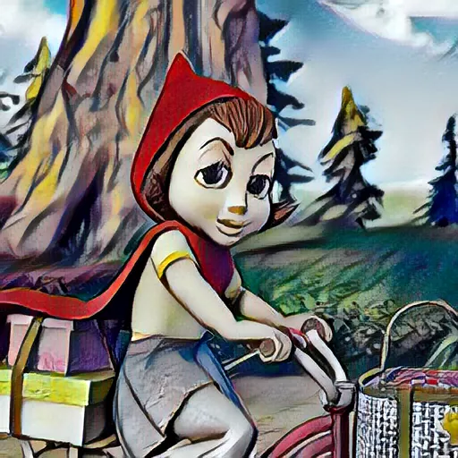</td>
<td align="center">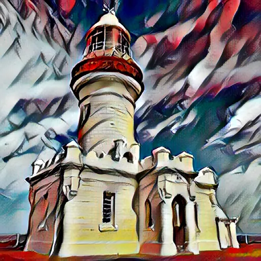</td>
</tr>
<tr>
<td align="center"></td>
<td align="center"></td>
<td align="center"></td>
<td align="center"></td>
</tr>
</table>

## Further reading

**The arc.** Style transfer starts as a *pixel-matching* problem ([Image Analogies](https://mrl.cs.nyu.edu/projects/image-analogies/), 2001): copy across style pixels whose neighbourhoods best match the content, with no learning at all. Gatys et al. ([2015](https://arxiv.org/abs/1508.06576)) reframe it as an *optimization* problem over deep VGG features — striking, but slow, since every output image is solved from scratch — and the next several years are spent making that fast.

The fast era runs in three parallel branches:

- **Feed-forward CNNs** trade per-image optimization for a single network pass — first one network per style ([Johnson et al.](https://arxiv.org/abs/1603.08155), 2016), then *arbitrary* style once the style is pushed through normalization layers: Magenta's *learned* conditional instance norm, [AdaIN](https://arxiv.org/abs/1703.06868)'s parameter-free mean/variance match, and [WCT](https://arxiv.org/abs/1705.08086)'s fuller covariance match. This is Magenta's branch, and the one this project leans on.
- **GANs** arrive from image-to-image translation, learning from a *collection* of style images ([CycleGAN](https://arxiv.org/abs/1703.10593), 2017) or a single exemplar ([MUNIT](https://arxiv.org/abs/1804.04732), 2018).
- **Transformers** replace the convolutional encoders with attention over image patches ([StyTr²](https://arxiv.org/abs/2105.14576), 2022).

[Diffusion](https://github.com/AnthonyBurre/diffusion-style-transfer) opens the current chapter, and is the pointed omission here.

### Implemented here

- **Image Analogies** — Hertzmann, Jacobs, Oliver, Curless & Salesin, [SIGGRAPH 2001](https://mrl.cs.nyu.edu/projects/image-analogies/). The pre-neural baseline.
- **A Neural Algorithm of Artistic Style** — Gatys, Ecker & Bethge, [arXiv:1508.06576](https://arxiv.org/abs/1508.06576) (2015). The founding optimization-based formulation.
- **Magenta arbitrary stylization** — Ghiasi et al., [arXiv:1705.06830](https://arxiv.org/abs/1705.06830) (2017), which generalizes the conditional instance norm of Dumoulin et al., [arXiv:1610.07629](https://arxiv.org/abs/1610.07629) (2017) to arbitrary styles via a style-prediction network.
- **StyTr²** — Deng et al., [arXiv:2105.14576](https://arxiv.org/abs/2105.14576) (CVPR 2022); reference implementation at [diyiiyiii/StyTR-2](https://github.com/diyiiyiii/StyTR-2), which this project vendors.

### The feed-forward lineage (not implemented)

The branch Magenta sits on, and the route I'd take to push arbitrary style transfer further. All are single-pass and not GANs:

- **Perceptual Losses** — Johnson, Alahi & Fei-Fei, [arXiv:1603.08155](https://arxiv.org/abs/1603.08155) (2016). The first fast feed-forward network — one network per style.
- **Instance Normalization** — Ulyanov et al., [arXiv:1607.08022](https://arxiv.org/abs/1607.08022) (2016). The normalization trick the whole branch leans on.
- **AdaIN** — Huang & Belongie, *Arbitrary Style Transfer in Real-Time with Adaptive Instance Normalization*, [arXiv:1703.06868](https://arxiv.org/abs/1703.06868) (ICCV 2017). Two things share the name: the AdaIN *layer*, which aligns the content features' per-channel mean and variance to the style's with no learned parameters, and the *method* built around it (VGG encoder → AdaIN → trained decoder) that does arbitrary, real-time stylization in one pass. It's the parameter-free counterpart to Magenta's *learned* conditional instance norm — same family, statistics computed on the fly rather than predicted — and the layer was later reused as a component elsewhere (e.g. StyleGAN's generator), which is the sense in which AdaIN turns up "inside" other models.
- **WCT** — Li et al., *Universal Style Transfer via Feature Transforms*, [arXiv:1705.08086](https://arxiv.org/abs/1705.08086) (2017). A parallel alternative to AdaIN from the same year, not a successor: where AdaIN matches only per-channel mean and variance, WCT's whitening-and-colouring transform matches the full feature covariance, capturing channel correlations AdaIN ignores — a more thorough style match at higher cost (eigendecompositions, a multi-level decoder pyramid), trained on no style images at all. Both remain in use; neither supersedes the other.

### GAN- and diffusion-based (not implemented)

- **CycleGAN** — Zhu et al., [arXiv:1703.10593](https://arxiv.org/abs/1703.10593) (2017). Learns a mapping from a *collection* of style images rather than a single exemplar — a different problem framing from everything above.
- **MUNIT** — Huang et al., [arXiv:1804.04732](https://arxiv.org/abs/1804.04732) (2018). Multimodal image-to-image translation; accepts a single style exemplar at inference but is GAN-based at its core.
- **Diffusion-based style transfer** — explored in the [sibling project](https://github.com/AnthonyBurre/diffusion-style-transfer), the pointed omission here.
