# Artistic Style Transfer Investigation

Remixing the content of one image into the style of another is the type of task that invites a variety of creative mathematical approaches. This project serves as a comparison of some of these methodologies, and a tool for testing them out.

1. **Optimization-based** (Gatys, Ecker & Bethge, 2015) - the founding approach, and the one that established neural style transfer as a problem at all. Each output image is iteratively optimized from scratch against content and style targets. Slow, but produces strikingly painterly results.
2. **Feed-forward CNN** (Magenta, 2017) - Google's answer to the speed problem. A learned network emits a stylized image in a single forward pass; results return in seconds, at the cost of a smoother, more averaged stylization than Gatys produces.
3. **Transformer** (StyTr², 2022) - feed-forward like Magenta, but trades convolutional encoders for attention over image patches, addressing Magenta's tendency to lose fine style detail and content tonality. Sits between the other two for speed (~30 s on CPU).

The pointed omission is **diffusion based style transfer** (ControlNet, IP-Adapter, InstantStyle, …) - arguably the dominant paradigm as of 2026, and explored in the [sibling project](https://github.com/AnthonyBurre/diffusion-style-transfer).

## Quick start

With [uv](https://docs.astral.sh/uv/) installed, sync the extra that matches your hardware:

| Hardware                              | Sync command                              |
| ------------------------------------- | ----------------------------------------- |
| Any CPU (Mac Intel, Linux, Windows)   | `uv sync --extra cpu`                     |
| Apple Silicon (Metal GPU)             | `uv sync --extra cpu --extra metal`       |
| NVIDIA GPU (Linux native, or WSL2)    | `uv sync --extra cuda`                    |

AMD/Intel GPUs have no working path.

Run the GUI at http://localhost:7860 for interactive exploration:

```shell
uv run python -m src.app
```

Use the CLI for scripting/batch processing:

```shell
uv run python -m src.cli \
  -c examples/content/lighthouse.png \
  -s examples/style/ty.png \
  -o out.png -m gatys
```
Accepts directories on `-c` / `-s` for batch runs, see `-h` for all flags:

```shell
uv run python -m src.cli -h
```

## Docker option

CPU-only, but no need to install uv or python:

```shell
docker build -t style-transfer .
docker run --rm -m 4g -p 7860:7860 style-transfer
```

CLI variant, with a host-mounted working dir so the output file lands back on the host:

```shell
docker run --rm -m 4g \
  -v "$PWD:/work" -w /work \
  -v "$PWD/model-stytr2:/app/model-stytr2" \
  style-transfer \
  src.cli -c examples/content/hoodwinked.png \
          -s examples/style/spiderverse.png \
          -o out.png -m stytr2
```

On Windows PowerShell replace `$PWD` with `${PWD}`; in `cmd.exe` use `%cd%`. Mount `$PWD/model:/app/model` instead when running Magenta, otherwise its weights re-download every invocation.

## Example Images

For those of you who are too busy to clone and run this yourself, I've included some examples here. A good model will work its magic on any sort of content image respectably, but it is more up to the user to select an optimal style image for best results.

### Content images (`examples/content/`)

<table>
<tr>
<td align="center" width="33%">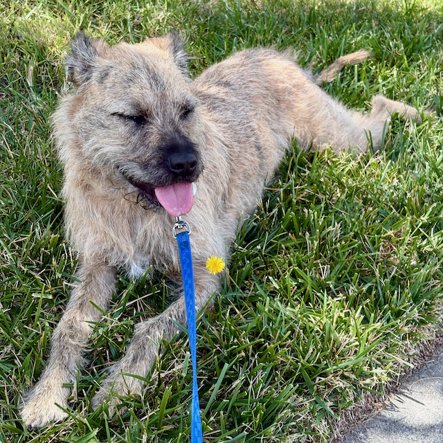</td>
<td align="center" width="33%">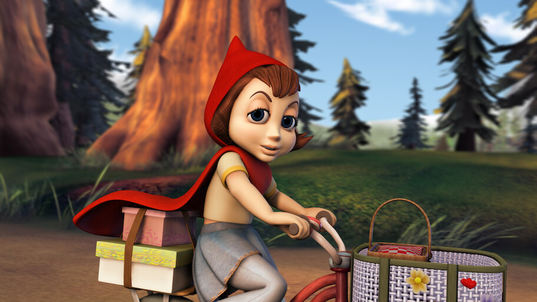</td>
<td align="center" width="33%">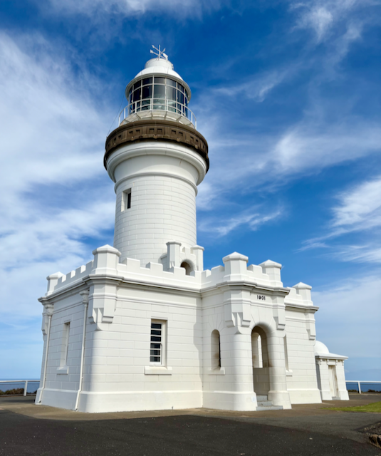</td>
</tr>
<tr>
<td align="center"><sub>640x640. My absolutely perfect dog Katy taking a rest during a sunny walk on some nice grass.</sub></td>
<td align="center"><sub>912×513. A frame of an old film whose graphics could use an update. Is style transfer the answer?</sub></td>
<td align="center"><sub>535×640. White architectural form against a wispy-cloud sky - hard high-contrast edges beside broad smooth gradient regions.</sub></td>
</tr>
</table>

### Style images (`examples/style/`)

<table>
<tr>
<td align="center" width="33%">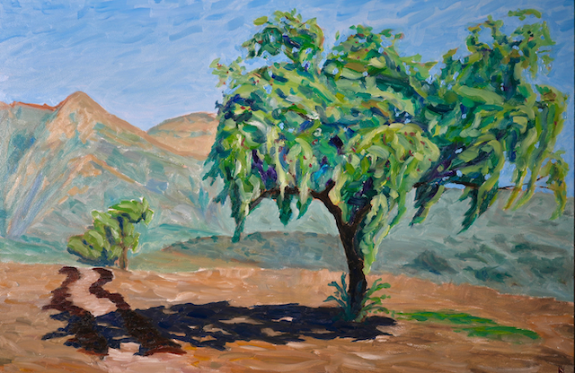</td>
<td align="center" width="33%">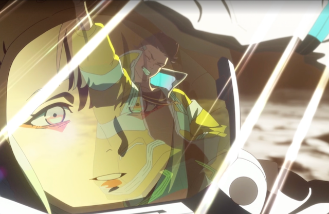</td>
<td align="center" width="33%">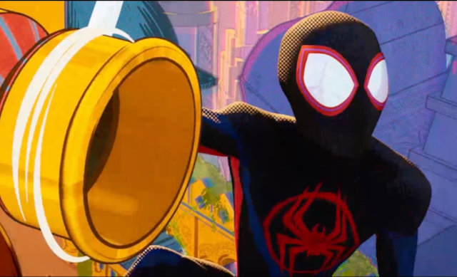</td>
</tr>
<tr>
<td align="center"><sub>Visible brushwork and a saturated landscape palette - the closest analogue here to the painted style images the original NST papers used.</sub></td>
<td align="center"><sub>Anime aesthetic: flat colour regions, bold line work, neon highlights against deep shadow. Modern digital-animation style rather than a traditional painting.</sub></td>
<td align="center"><sub>Halftone dots, chromatic aberration, comic-book outlines and a vibrant complementary palette.</sub></td>
</tr>
</table>

## Models

This project compares three models, each a representative of a distinct era in how dedicated neural style transfer evolved between 2015 and 2022. Out of scope alongside the diffusion-prior omission noted above: pre-neural patch-based methods (Image Quilting, Efros & Freeman 2001), GAN domain transfer (CycleGAN and descendants), and video/3D/NeRF variants. The bracketing claim is on the dedicated-neural-style-transfer era specifically.

### Gatys VGG19 - optimization-based neural style transfer

The original Gatys, Ecker & Bethge (2015) formulation. Treats style transfer as an inverse problem: initialize from the content image, then minimize a weighted sum of a content loss (MSE on `block5_conv2` activations), a style loss (MSE on Gram matrices across `block{1..5}_conv1`), and a total-variation regularizer, via Adam over the pixel tensor for ~300 steps per request. There is no learned style mapping - the model parameters are the output pixels themselves, which is what makes it slow. Because Gram matrices encode texture statistics rather than spatial layout, output is markedly more abstracted and painterly than the feed-forward methods: content geometry survives, but objects bleed into the style's brushwork and palette in a way the others never quite manage.

Notes:
Both inputs are downsampled to 512 px longest-side (`MAX_DIM` in `src/methods/gatys.py`) — a CPU/4 GB-container budget cap; aspect ratio is preserved. Raise it to 768 or 1024 for higher-resolution output.

<table>
<tr>
<td></td>
<td align="center" width="25%"></td>
<td align="center" width="25%"></td>
<td align="center" width="25%"></td>
</tr>
<tr>
<td align="center" width="25%"></td>
<td align="center">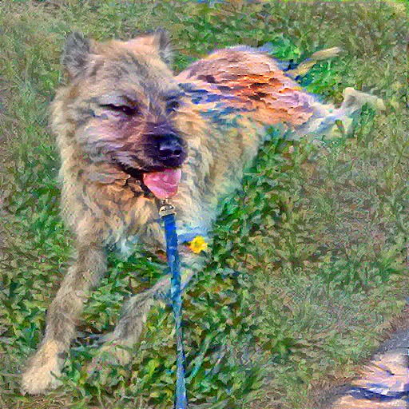</td>
<td align="center">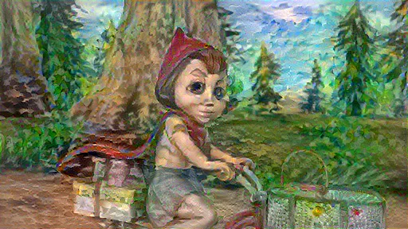</td>
<td align="center">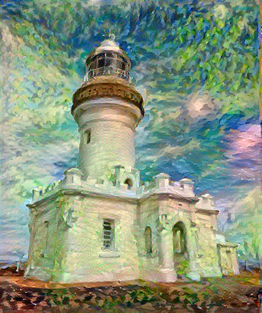</td>
</tr>
<tr>
<td align="center"></td>
<td align="center">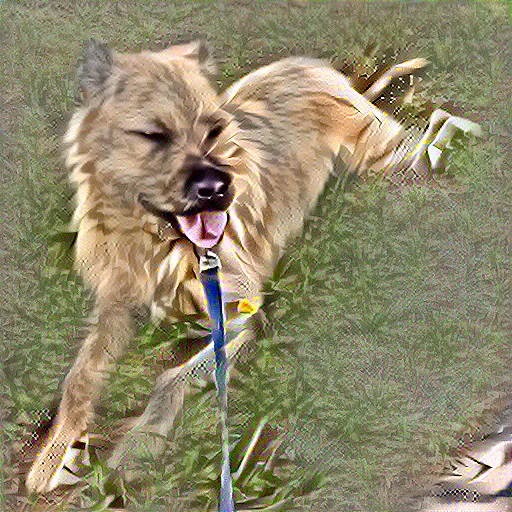</td>
<td align="center">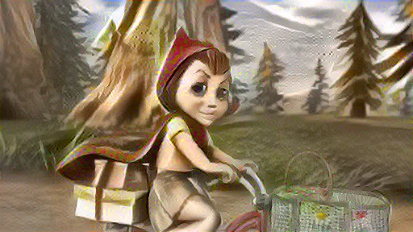</td>
<td align="center">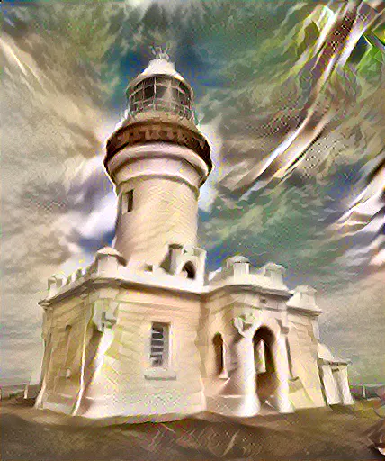</td>
</tr>
<tr>
<td align="center"></td>
<td align="center">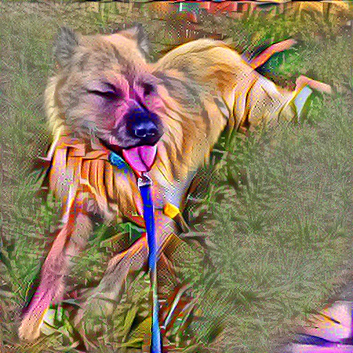</td>
<td align="center">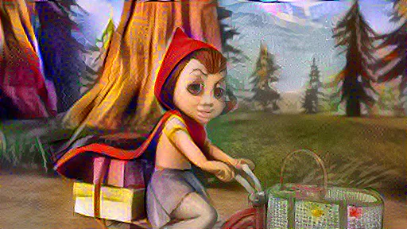</td>
<td align="center">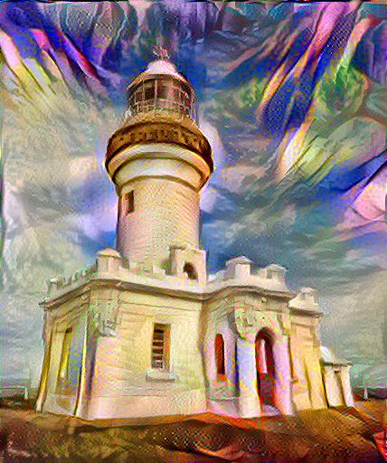</td>
</tr>
</table>

### Magenta - feed-forward arbitrary stylization

Ghiasi et al., Google Magenta (2017). A style-prediction sub-network compresses the style image into a low-dimensional embedding that parameterizes conditional instance-norm layers in a transfer network operating on the content image; the stylized image comes out in a single forward pass - no per-image optimization, no attention. That is why it returns in seconds, and also why it tends toward a smoother, more "averaged" stylization than the other two: a single global style vector cannot localize fine ornament or hard edges in the style image to specific regions of the content. Colour palettes transfer well; high-frequency style detail tends to dissolve into the content's textures rather than persist as discrete marks.

The transfer network runs fully-convolutionally, so output resolution tracks the content image's aspect ratio up to a 2048 px longest-side cap.

<table>
<tr>
<td></td>
<td align="center" width="25%"></td>
<td align="center" width="25%"></td>
<td align="center" width="25%"></td>
</tr>
<tr>
<td align="center" width="25%"></td>
<td align="center">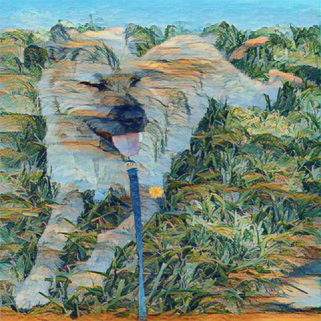</td>
<td align="center">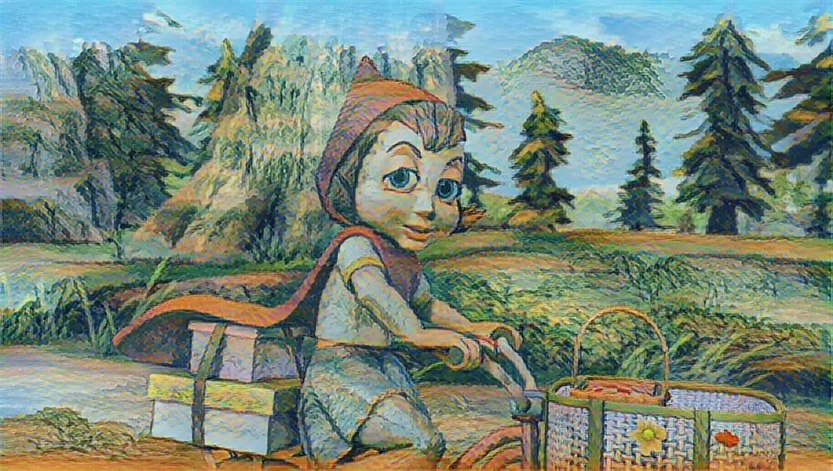</td>
<td align="center">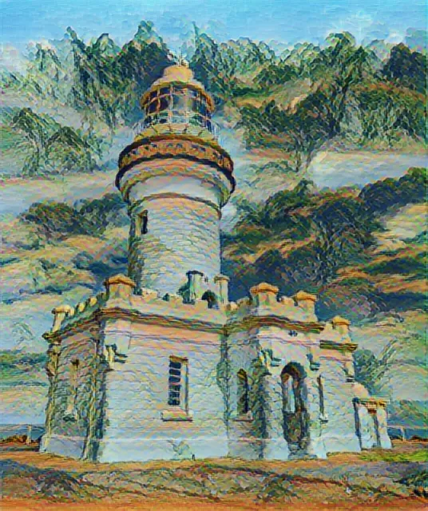</td>
</tr>
<tr>
<td align="center"></td>
<td align="center">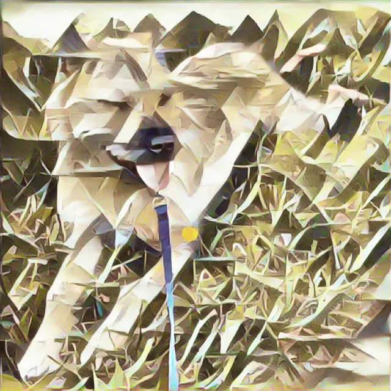</td>
<td align="center">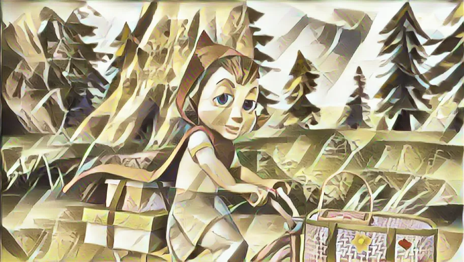</td>
<td align="center">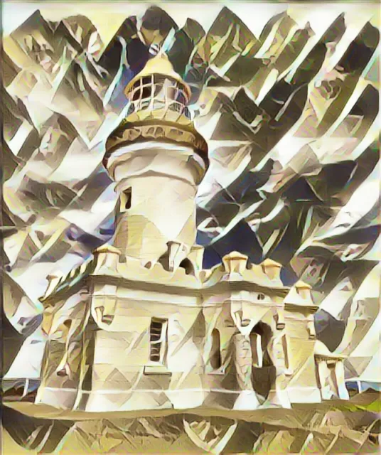</td>
</tr>
<tr>
<td align="center"></td>
<td align="center">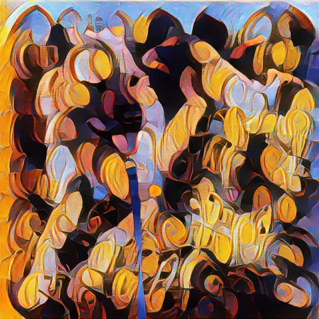</td>
<td align="center">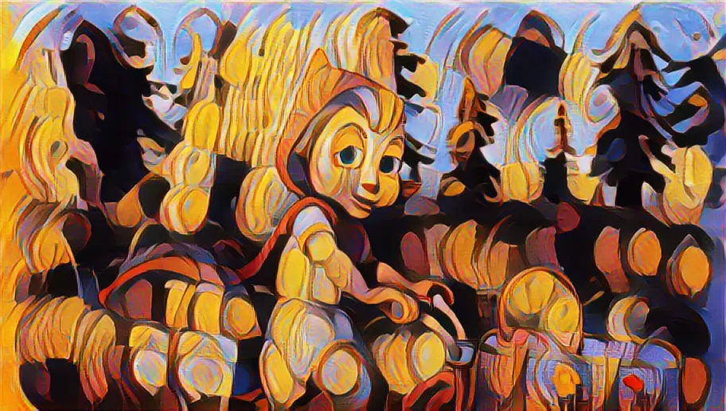</td>
<td align="center">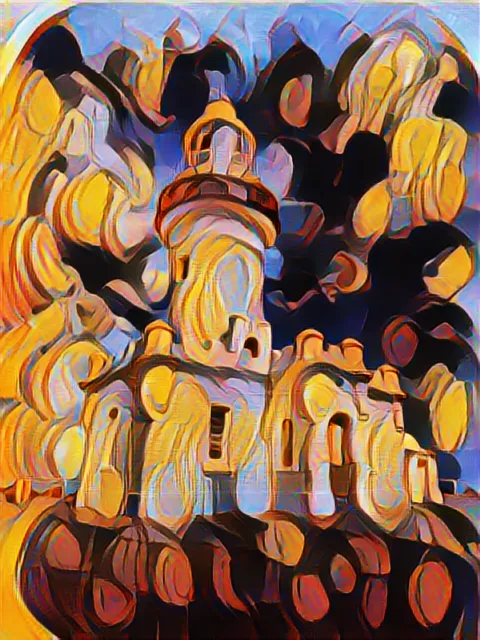</td>
</tr>
</table>

### StyTr² - transformer-based arbitrary style transfer

Deng et al. (CVPR 2022). A pure-transformer alternative to both CNN feed-forward (Magenta) and per-image optimization (Gatys). Content and style images are tokenized via a stride-8 patch embedding, encoded by separate transformer stacks with content-aware positional encoding (CAPE), and fused by a cross-attention decoder before a convolutional upsampler returns to image space. Because attention operates patch-wise rather than through a single global style code, fine style detail and content tonality (notably true blacks) survive better than in Magenta, while inference stays feed-forward - runtime sits between the other two at ~30 s on CPU at 512², bounded by the O(N²) attention over 64×64 = 4096 tokens. The price: the patch-grid reshape requires `H == W`, so wide content is centre-cropped to 512×512 before inference and loses its outer regions. Pretrained weights are pulled from the `datnguyentien204/Sty_TR2_38` Hugging Face mirror on first use.

Notes:  
Apple silicon:  StyTr² stays on CPU here — PyTorch's MPS backend hits [pytorch#96056](https://github.com/pytorch/pytorch/issues/96056) on this model's adaptive-pool op.
StyTr² prints the device it loaded onto on first call.

<table>
<tr>
<td></td>
<td align="center" width="25%"></td>
<td align="center" width="25%"></td>
<td align="center" width="25%"></td>
</tr>
<tr>
<td align="center" width="25%"></td>
<td align="center">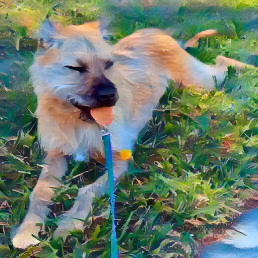</td>
<td align="center">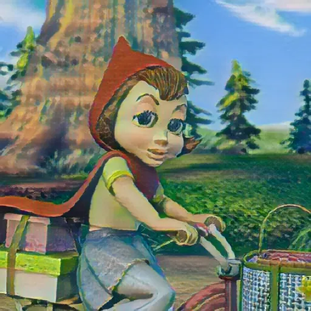</td>
<td align="center">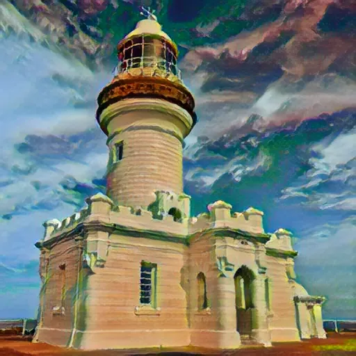</td>
</tr>
<tr>
<td align="center"></td>
<td align="center">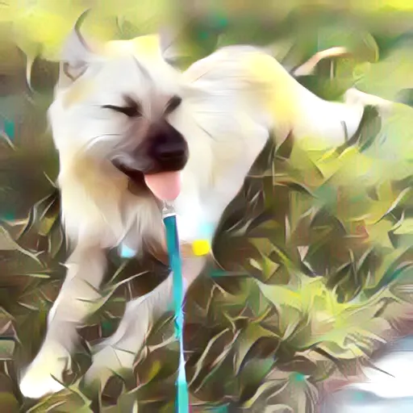</td>
<td align="center">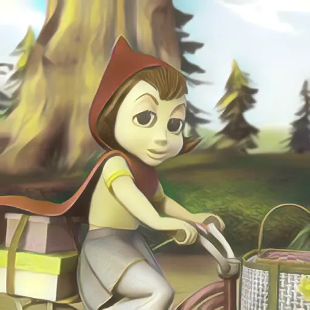</td>
<td align="center">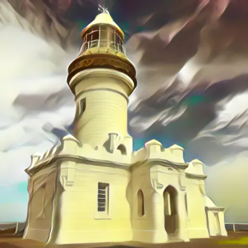</td>
</tr>
<tr>
<td align="center"></td>
<td align="center">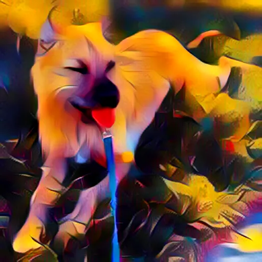</td>
<td align="center">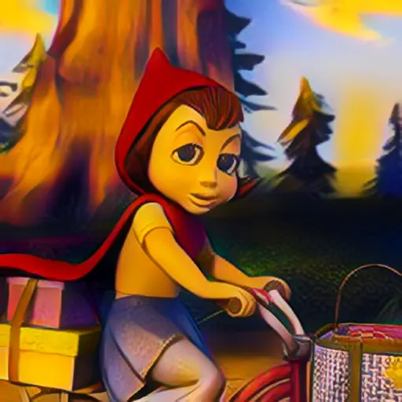</td>
<td align="center">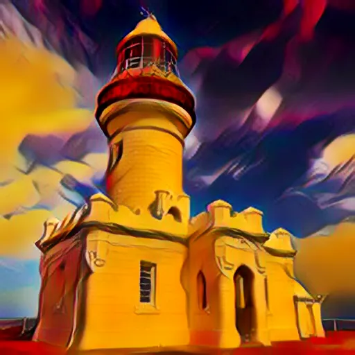</td>
</tr>
</table>
