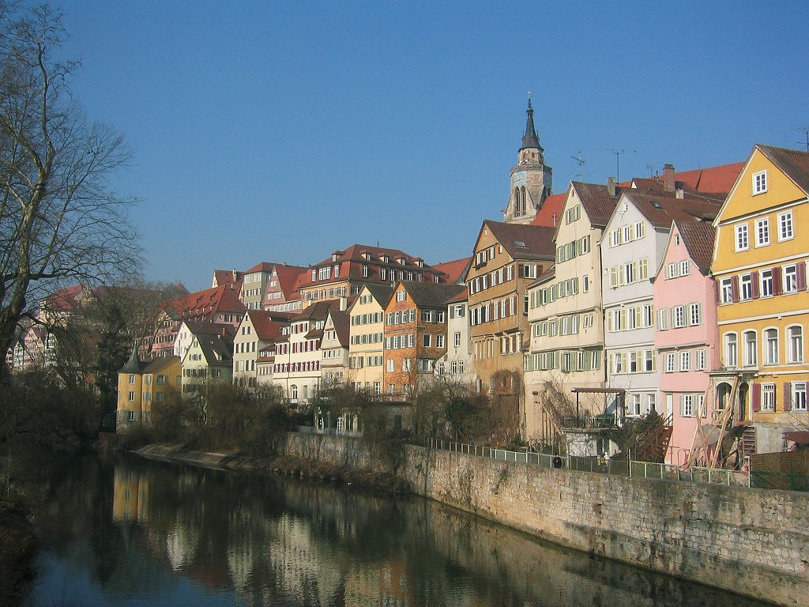
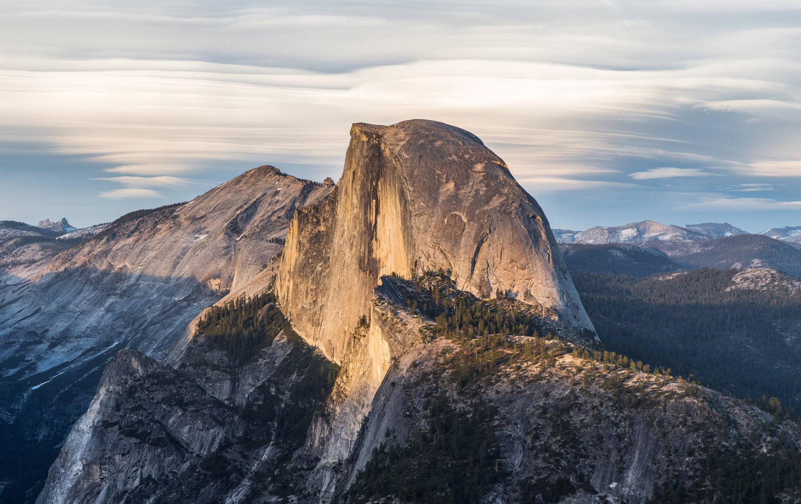
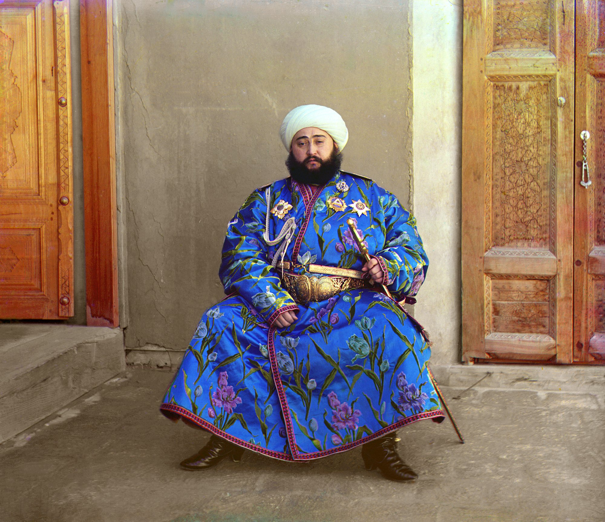
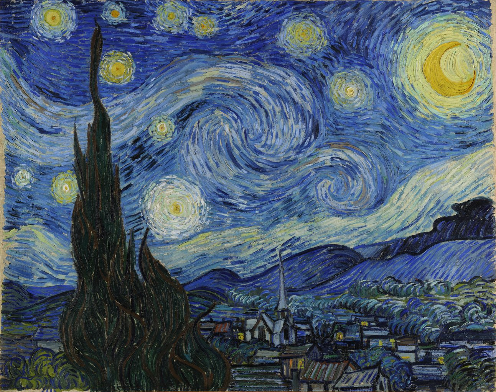
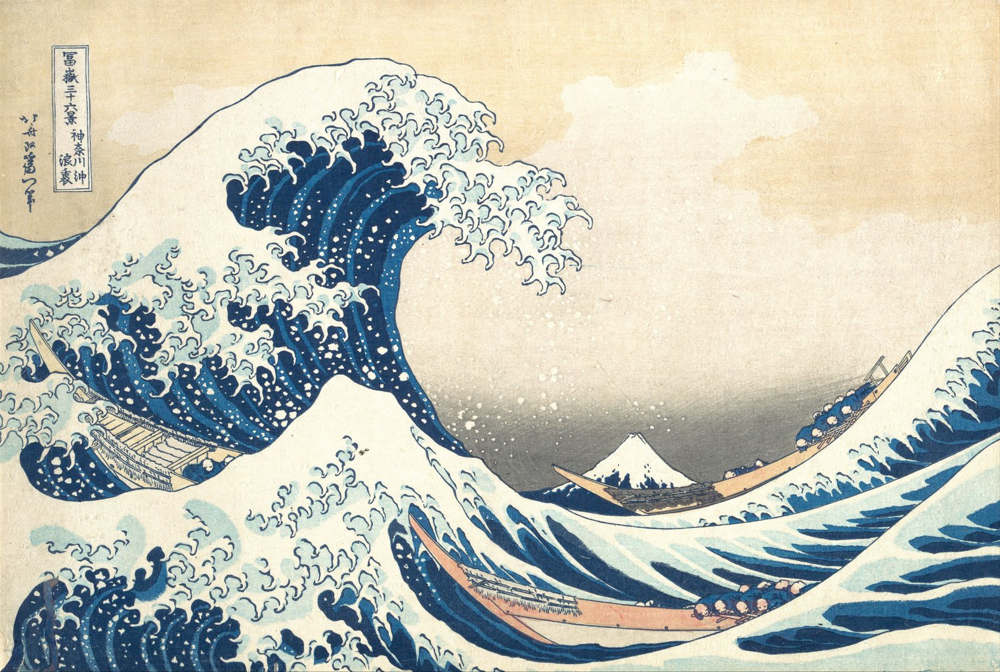
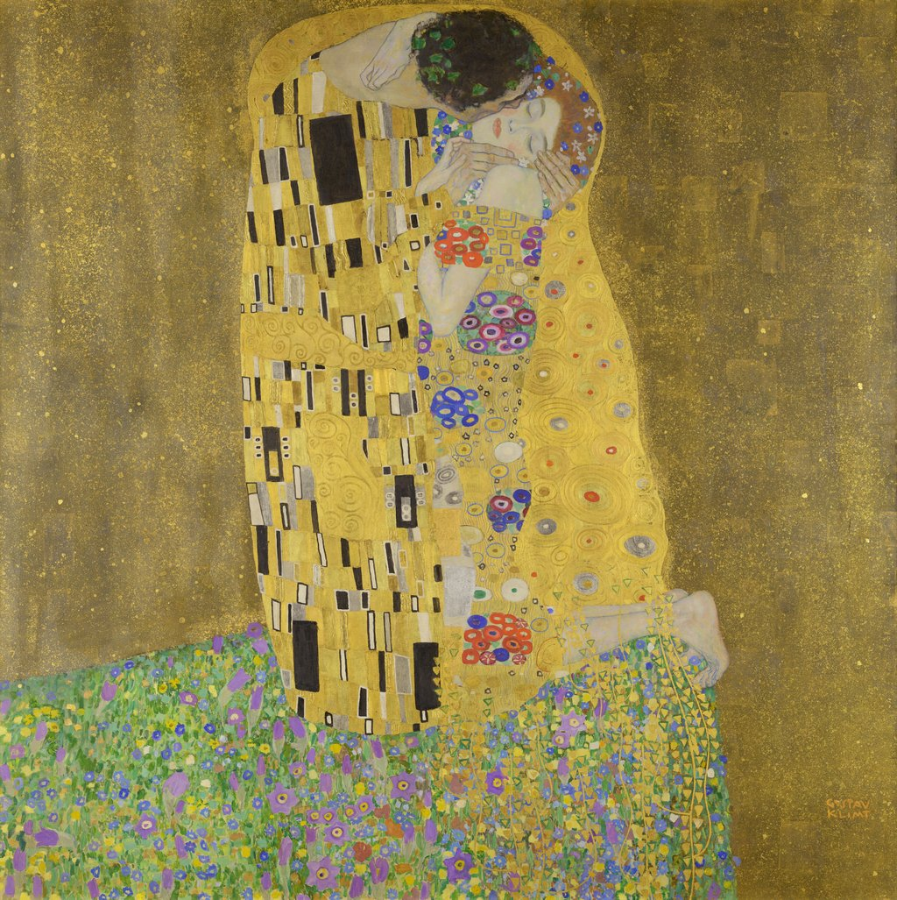

# Artistic Style Transfer Investigation

A Gradio web app for image-to-image artistic style transfer. Three methods are available, selectable in the UI per request:

- **Magenta** (`arbitrary-image-stylization-v1-256` from TF Hub) — feed-forward inference, returns in seconds.
- **Gatys VGG19** — optimisation-based neural style transfer (Gatys, Ecker & Bethge, 2015). Slower but produces more abstracted, painterly results.
- **StyTr²** (Deng et al., CVPR 2022) — transformer-based feed-forward inference. ~30 s per image on CPU; tends to preserve content tones (e.g. true blacks) better than the other two. Pretrained weights are pulled from the `datnguyentien204/Sty_TR2_38` mirror on Hugging Face on first use.

## Examples

The `examples/` folder ships six public-domain images chosen so that each method's distinctive behaviour is visible somewhere in the matrix.

### Content images (`examples/content/`)

<table>
<tr>
<td align="center" width="33%"><br><b>Tübingen Neckarfront</b></td>
<td align="center" width="33%"><br><b>Half Dome, Yosemite</b></td>
<td align="center" width="33%"><br><b>Emir of Bukhara, 1911</b></td>
</tr>
<tr>
<td align="center"><sub>1024×768. The canonical content image from Gatys, Ecker &amp; Bethge (2015) — keeps results comparable to published NST work.</sub></td>
<td align="center"><sub>2000×1258. Broad sky/rock regions and smooth gradients; the "kind" content where every method produces something defensible.</sub></td>
<td align="center"><sub>2000×1729. A Prokudin-Gorsky color photograph — faces stress every method, since small style perturbations on facial features look catastrophic.</sub></td>
</tr>
</table>

### Style images (`examples/style/`)

<table>
<tr>
<td align="center" width="33%"><br><b>Van Gogh — <i>The Starry Night</i></b><br><sub>1889</sub></td>
<td align="center" width="33%"><br><b>Hokusai — <i>The Great Wave off Kanagawa</i></b><br><sub>c. 1831</sub></td>
<td align="center" width="33%"><br><b>Klimt — <i>The Kiss</i></b><br><sub>1907–08</sub></td>
</tr>
<tr>
<td align="center"><sub>Heavy impasto and swirling brushwork. The most-cited NST style image; best showcase for <b>Gatys</b>'s painterly Gram-matrix abstraction.</sub></td>
<td align="center"><sub>Bold black outlines and flat colour regions. Directly tests <b>StyTr²</b>'s tone-preservation claim — Magenta's instance-norm averaging tends to grey the outlines, StyTr² holds them.</sub></td>
<td align="center"><sub>Byzantine gold-leaf ornament beside flat figural regions. Mixed-frequency style is where patch-level cross-attention diverges from a global style code.</sub></td>
</tr>
</table>

### Sizing and aspect ratio

Style images are sized to ≥ 1024 px on the shortest side; content images to ≥ 2000 px on the longest side. The dimensions are deliberately non-uniform: aspect ratio is preserved on disk because each method handles non-square inputs differently.

- **Magenta** runs the transfer network fully-convolutionally, so output resolution tracks the content image (up to a 2048 px longest-side cap). The 2000-px content sources let it actually produce 2000-px output.
- **Gatys** downsamples both inputs to 512 px longest-side (a CPU/4 GB-container budget cap).
- **StyTr²** does a square center-crop to 512×512 — the transformer's patch-grid reshape requires `H == W`. Wide content like *Half Dome* loses its outer thirds when run through StyTr². This is a real behaviour of the model, not a bug, and the example images are sized so it is visible.

Sources (all via Wikimedia Commons): paintings are PD by age; *Tübingen Neckarfront* by Andreas Praefcke; *Half Dome from Glacier Point* by [Diliff](https://commons.wikimedia.org/wiki/User:Diliff) (CC BY-SA); *Emir of Bukhara* by Sergei Prokudin-Gorsky (1911, PD).

## Run with Docker

The simplest, most reproducible option:

```shell
docker build -t style-transfer .
docker run --rm -m "4g" -p 7860:7860 style-transfer
```

Open http://localhost:7860.

Docker Desktop on Mac runs in a Linux VM with no access to the host GPU, so this path is CPU-only. Fine for Magenta; Gatys will take several minutes per image.

## Run on the host

Useful for faster iteration on Gatys, and required to use the GPU on Apple Silicon (see below):

```shell
.venv/bin/python -m src.app
```

### Optional: Metal GPU acceleration (Apple Silicon)

Apple's `tensorflow-metal` plugin lets TensorFlow execute on the M-series GPU via Metal. On an M2, 300-step Gatys drops from several minutes to roughly 30–60 s, and you can raise `MAX_DIM` in `src/methods/gatys.py` to 768 or 1024 to get higher-resolution output.

```shell
.venv/bin/pip install tensorflow-metal
.venv/bin/python -c "import tensorflow as tf; print(tf.config.list_physical_devices('GPU'))"
```

The check command should print a non-empty list containing a GPU device, then run normally.

`tensorflow-metal` is deliberately not in `requirements.txt`: it only installs on macOS arm64 and would break the Linux Docker build. If `tensorflow-metal` and `tensorflow==2.19.0` ever fall out of sync (the plugin pins to specific TF versions), pip will warn during install — that's almost always the cause if the GPU check returns an empty list afterwards.
